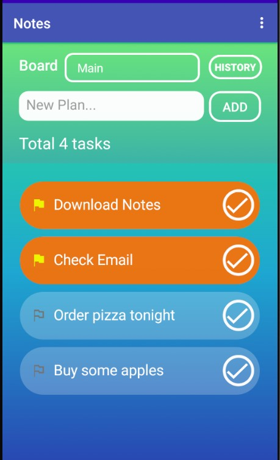
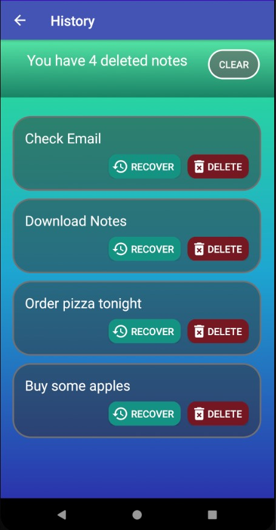
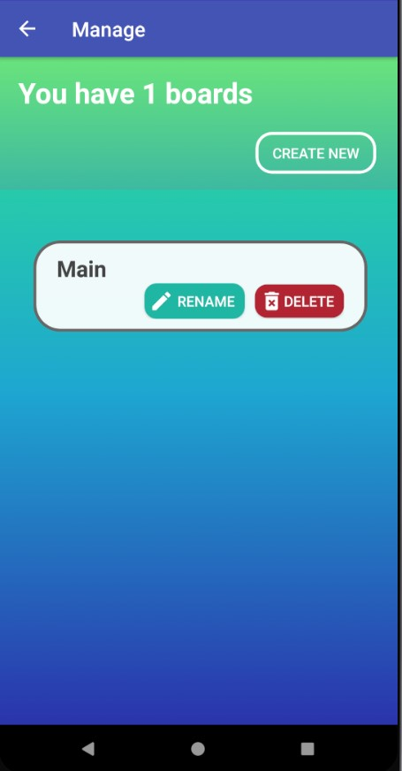
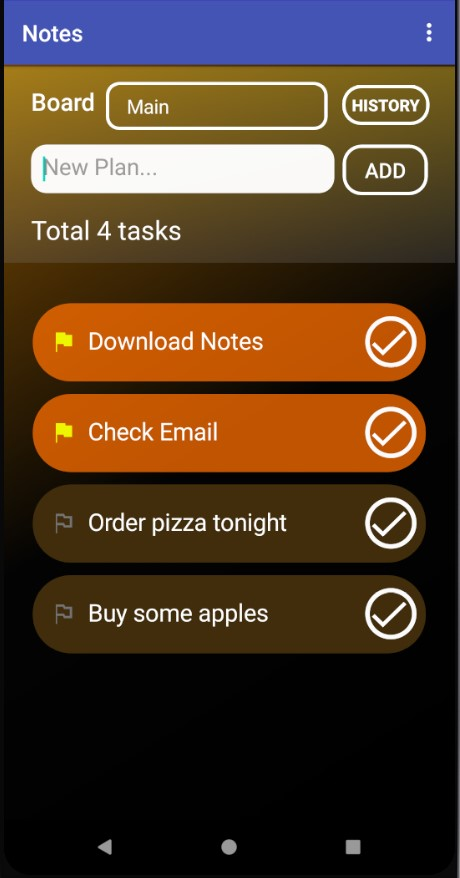
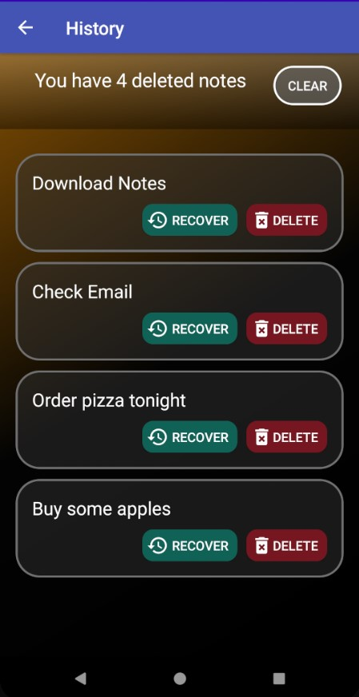
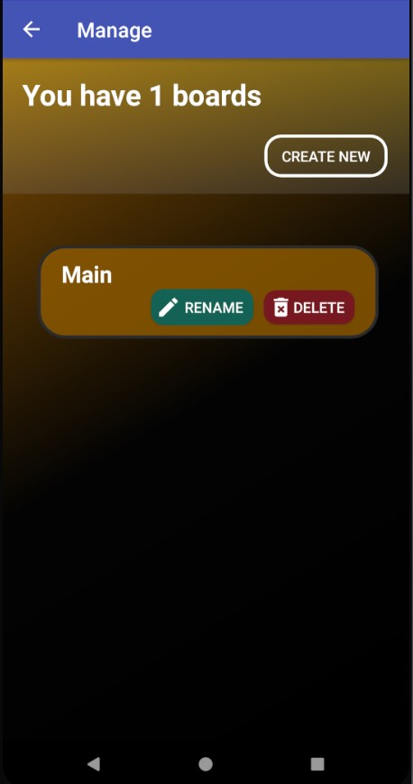
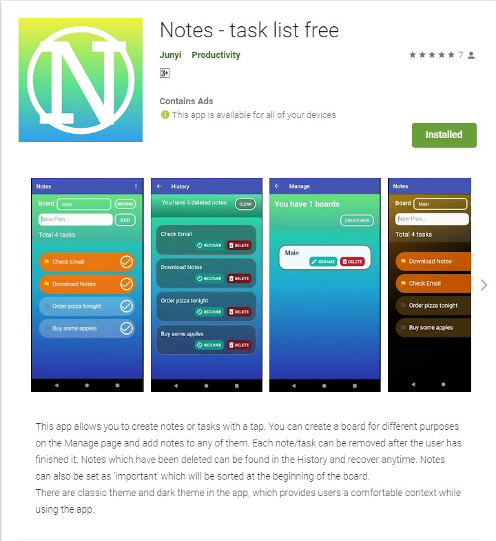

# Notes-task-list-free

  

# About Notes-task list free
Notes-task list free is an Android application develop using Java. The app allows users to create notes or tasks with a tap. You can create a board for different purposes on the Manage page and add notes to any of them. Each note/task can be removed after the user has finished it. Notes which have been deleted can be found in the History and recover anytime. Notes can also be set as 'important' which will be sorted at the beginning of the board. There are classic theme and dark theme in the app, which provides users a comfortable context while using the app.

# Preview

#### Classic Theme

  
  
  

#### Dark Theme

  
  
  

# Google Play
#### Notes- task list free has been published on Google play. You are welcome to try it on and provide feedback.

